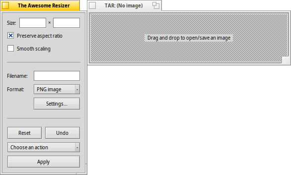

 **The Awesome Resizer**   
originally by Jonathan Villemure for the BeOS

* * *

The Awesome Resizer (aka "TAResizer" or "TAR") is an application for quick dynamic resizing of an image. A number of effects can be applied as well.

## How it works

- Image files are opened and saved via drag'n'drop. For opening, you may also click the dropzone for a file open dialog.
- Resizing the window (remember, also possible by CTRL+ALT+right-mouse-dragging) resizes the image.
- You can also enter width and height directly in the "Size" text boxes.
- Uncheck "Preserve aspect ratio" and the image will fit the entire window, stretching the image's width/height.
- Check "Smooth scaling" to improve the visual quality of shrinked images.  (I tried to implement it to be done on-the-fly while resizing but I lost the "smooth resizing" feel, so I decided to put it separetly.  It only works with shrinked images.)

- "Filename" contains the name of the file that will be created when you drag'n'drop an image from the TAR window.
- "Format" allows you to choose the output file format (you MUST select one).
- Clicking "Settings…" opens the current Translator's settings.
- Left-click on the modified image and drag it out (into a folder or onto the desktop) to create a new image in the chosen output format.
- You can also right-click-and-drag to specify a particular region of the image to save! Click outside the selected area to dismiss it.

- "Reset" resizes the image to its original size, removing all effects along the way.
- "Undo" undoes the last action applied to the image.
- "Action" : (Use "Apply" to execute the choosen action)
	- 90° rotation : Rotate the image 90° counter clock-wise.
	- Flip top-bottom : Flip the image around the horizontal axis.
	- Flip left-right : Flip the image around the vertical axis.
	- Brightness : Lighten the image.
	- Darkness : Darken the image.
	- Blur : Usefull function to apply after having resized your image.
	- Melt : A home-made effect.
	- Drunk : A funny effect.  Use it on a screenshot with text and you will know where the name came from… :-)
	- Grayscsale : Convert a color image to grayscale.
	- Invert : Invert the colors of the image.
	- Swap X-Y : Swap the "X" and "Y" channels.
	- Screenshot : Take a picture of your current screen.

---

## Frequently asked questions
* How do I save an image?   
You drag'n'drop it from the image window onto the Desktop or another open folder.
* I try to drag the image out but nothing happens…    
You must have an image loaded, the "Filename" box mustn't be empty, and you must choose an output format (jpg, png, etc.)
