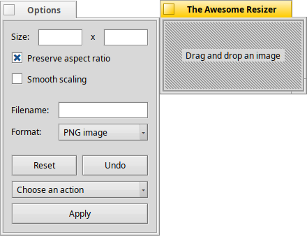

# The Awesome Resizer v3.3
### Copyright ©1999-2000
-----------------------------------------------------------------------------
**Author**: Jonathan Villemure\
**E-mail**: jvillemure@bigfoot.com\
**Web page**: http://www.bigfoot.com/~jvillemure \
**Description**: TAResizer is a freeware application that allows quick dynamic resizing of any translator supported image and much much more.\
**Platform:** Compiled under BeOS R5 (Intel Only)\
**Version:** 3.3

---

## How it works (The "Manual")

- Drag'n Drop an image file on the window to show it, or click the dropzone for a file open dialog.
- Resizing the window (with the borders) resize the image.
- You can also enter the width and height directly.
- Uncheck "Aspect Ratio" and the image will fit the entire window.
- "Reset" resize the image to its original size, removing all effects along the way.
- "Undo" undo the last action done on the image.
- "Smooth scaling", to improve the visual quality of shrinked images.  (I tried to implement it to be done on-the-fly while resizing but I lost the "smooth resizing" feel, so I decided to put it separetly.  It only works with shrinked images)

- "Filename" contains the name of the file that will be created.
- "Format" Allow you to choose your preferred output format (you MUST select one).
- Click on the modified image and drag it out (in a folder or on the desktop) to create a new image in the choosen output format.
- You can also do a right-click drag to specify a particular region of the image to save !

- "Action" : (Use "Apply" to execute the choosen action)
	- 90 rotation : Rotate the image 90 deg counter clock-wise.
	- Flip Top-Bottom : Flip the image around the horizontal axis.
	- Flip Left-Right : Flip the image around the vertical axis.
	- Light : Lighten the image.
	- Darkness : Darken the image.
	- Blur : Usefull function to apply after having resized your image.
	- Melt : Home-made effect.
	- Drunk : Funny effect.  Use it on a screenshot with text in it and you will know where the name came from :-)
	- Black & White : Convert color image to Black and White image. (Cool !)
	- Invert : Invert the colors of the image (Not very useful but everybody has it, so...)
	- Swap X-Y : Swap the "X" and "Y" channels.
	- Screenshot : Take a screenshot of your current Desktop.

---

## Changelog

#### What's new (in v3.3)?
- Support for localization
- Click into dropzone window for file open dialog

#### What's new (in v3.2)?
- New Coord window shows current mouse position & size of current selection.
- New Grip option allows easier resizing. (bigger resize corner)

#### What's new (in v3.1)?
- Recompiled for R5.

#### What's new (in v3.0)?
- Undo (for most effects, 8 levels of undo max)
- Smooth scaling (when shrinking image)
- Fixed a bug in the "blur" effect.
- And misc. improvements

#### What's new (in v2.2)?
- The selection rectangle flick less than before.
- New color swaping effects
- Added progress indicator in the Title Tab.

#### What's new (in v2.1)?
-Nothing except that TAResizer is now FREEWARE !!!

---

## F.A.Q.
#### I try to drag the image out but nothing happen...
**You must have an image loaded, the "File" Box must NOT be empty and you must choose an output format (jpg, bmp, etc)**

-----------------------------------------------------------------------------

-Comments ?  Questions ?  Suggestions ?  Want more Informations ?  Reproductible Bug ?  Bad spelling in this readme ?
Write to jvillemure@bigfoot.com